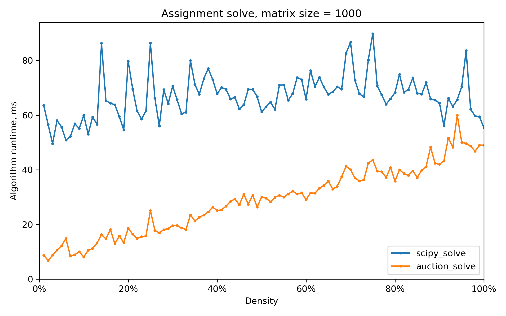

## SSLAP

This library provides implementations for solvers for **S**uper **S**parse **L**inear **A**ssignment **P**roblems.

An assignment problem is one where a one-to-one assignment has to be made between two sets, where each assignment has an associated cost.

In super sparse assignment problems, typically less than 1% of all feasible assignments are allowed.

This library provides two algorithms:
- Auction Algorithm - An algorithm well suited for super sparse problems. It is one in which *people* in one set 'bid' for *objects* in the other set, driving up their prices in order to find an optimal assignment. 
- Sparse Hungarian - A simple implementation of the Hungarian Algorithm, leveraged for sparse matrices

Both of these problems are implemented in Cython, with a pure Python implementation of the Hungarian algorithm also provided.

## Installation

TODO 

## Benchmarking

