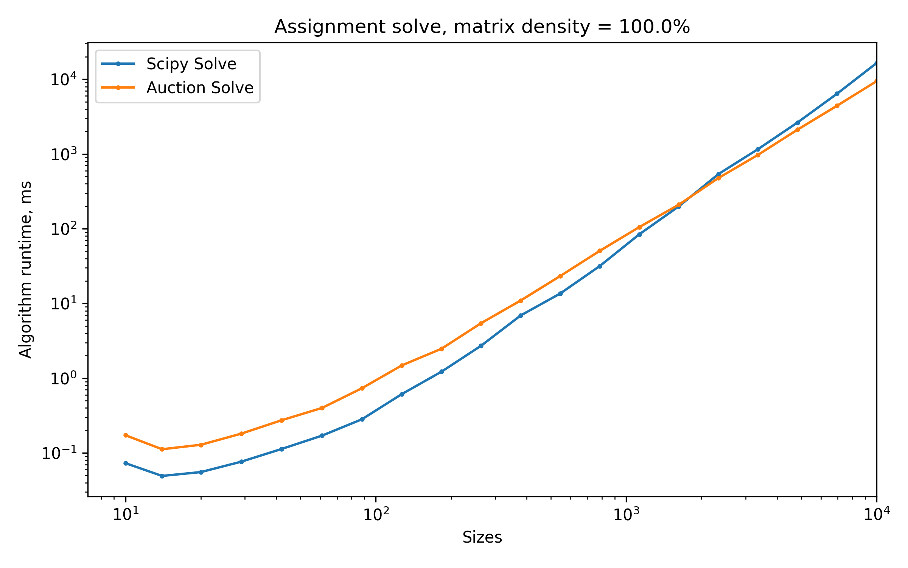

## SSLAP

This library provides implementations for solvers for **S**uper **S**parse **L**inear **A**ssignment **P**roblems.

An [assignment problem](https://en.wikipedia.org/wiki/Assignment_problem) is one where a one-to-one assignment has to be made between two sets, where each assignment has an associated cost.

In super sparse assignment problems, typically less than 1% of all feasible assignments are allowed.

This library provides a Cython implementation of the [Auction Algorithm](https://en.wikipedia.org/wiki/Auction_algorithm) [1], which is well suited for super sparse problems. It is one in which *people* in one set 'bid' for *objects* in the other set, driving up their prices in order to find an optimal assignment. 

Also provided is an implementation of the [Hopcroft-Karp Algorithm](https://en.wikipedia.org/wiki/Hopcroft%E2%80%93Karp_algorithm) [2] for finding a maximum matching in a bipartite graph. This is used by the Auction solver to check that a given problem has a valid solution.

## Installation

Tested on Windows (Python 3.8):

```pip install sslap```

Tested on Linux (Python 3.7):

```pip install git+https://github.com/OllieBoyne/sslap.git```

## Usage

- For usage of the Auction Algorithm, view `examples/test_auction.py`
- For usage of Hopcroft-Karp, view `examples/test_feasibility.py`

## Benchmarking

The algorithm is best suited for large and sparse problems, where it outperforms `scipy.optimize.linear_sum_assignment`.

See below for some timed comparisons of the runtime for problems of varying density (% of valid entries in the matrix) and matrix size.




## Notes

- A matrix passed into from_matrix requires positive values only, and -1 indicates invalid values.
- If the matrix is sufficiently large (experiments show N > 120k), auction_solve may crash unexpectedly. To avoid this, pass in the argument `cardinality_check=False` to auction_solve

[1] Bertsekas, D. [A Distributed Algorithm for the Assignment Problem](https://www.mit.edu/~dimitrib/Orig_Auction.pdf) (1979)

[2] Hopcroft J. Karp, R. An n^(5/2) algorithm for maximum matchings in bipartite graphs (1973)

